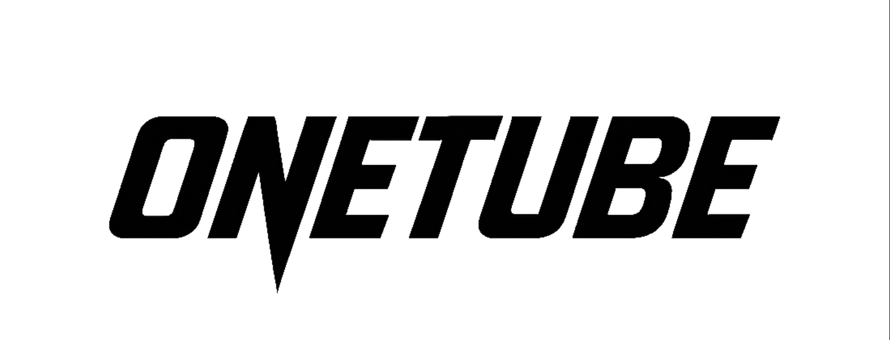

<div align="center">




NFT保有による動画視聴権限管理のデモプラットフォーム（MVP）

</div>

## 📖 概要

OneTubeは、ONE Championshipの試合動画をNFT保有によって視聴できるプラットフォームのデモです。Suiエコシステム（Kiosk、Sponsored Transaction、Transfer Policy）とWalrus/Sealを統合し、Web2的なシームレスな購入体験を実現します。

### 主な機能

- 🎫 **NFT購入**: Kiosk経由でプレミアムチケットNFTを購入（0.5 SUI）
- 🎬 **動画視聴**: NFT保有者だけが完全版動画を視聴可能
- 💰 **収益分配**: 購入時に自動で収益を分配（アスリート70% / ONE 25% / Platform 5%）
- ⛽ **ガス代不要**: Sponsored Transactionでユーザーのガス代をプラットフォームが負担

## 🚀 クイックスタート

### 前提条件

- Node.js 18+
- pnpm 10.x
- Sui CLI

### セットアップ

```bash
# 依存関係のインストール
pnpm install

# 環境変数の設定
cp .env.example .env
# .envファイルを編集して必要な値を設定

# スマートコントラクトのデプロイ
pnpm run deploy:devnet

# NFTのシード（Kioskに出品）
pnpm run seed:devnet

# フロントエンド起動
pnpm run dev

# バックエンドの起動
pnpm run dev:server
```

## 📁 プロジェクト構成

```
one-tube/
├── contracts/          # Moveスマートコントラクト
├── app/               # React + Express (フロントエンド・バックエンド)
├── scripts/           # デプロイ・シードスクリプト
└── docs/              # プロジェクト仕様書・開発ガイド
```

## 🛠️ テックスタック

- **Blockchain**: Sui devnet
- **Smart Contract**: Sui Move
- **NFT販売**: Kiosk標準 (TransforPolicy)
- **ガス代負担**: Sponsored Transaction
- **ストレージ**: Walrus Testnet（分散型動画保存）
- **アクセス制御**: Seal（暗号化/復号）
- **Frontend**: React + Vite
- **Backend**: Express + TypeScript

## 📝 主要コマンド

```bash
# Moveコントラクトのテスト
pnpm run move:test

# スマートコントラクトのデプロイ
pnpm run deploy:devnet

# NFTのシード（Kioskに出品）
pnpm run seed:devnet

# 開発サーバー起動（フロントエンド）
pnpm run dev

# 開発サーバー起動（バックエンド）
pnpm run dev:server

# コードフォーマット
pnpm run format

# リンター
pnpm run biome:check
```

## 🔄 ユーザーフロー

1. **ウォレット接続**: Sui Walletで接続
2. **NFT購入**: KioskからプレミアムチケットNFTを購入（ガス代不要）
3. **動画視聴**: NFT保有者として完全版動画を視聴（セッション有効期限: 30秒（任意））

## 💡 ビジネスモデル

- **収益分配**: アスリート 70% / ONE Championship 25% / Platform 5%
- **価格**: 0.5 SUI（テスト用）
- **特典**: 1ヶ月間過去試合見放題

## 📚 ドキュメント

詳細な仕様や開発ガイドは `docs/` ディレクトリを参照してください。

- [プロジェクト仕様書](docs/project-spec.md)
- [開発ワークフロー](docs/development-workflow.md)

## 📄 ライセンス

MIT
