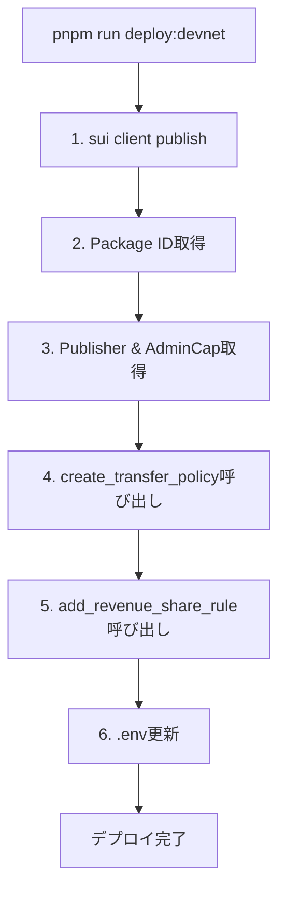

# OneTube - デプロイ・シードスクリプト実装仕様書

## 1. 機能概要

### 目的
Sui devnetへのスマートコントラクトデプロイと、NFTの初期セットアップを自動化するスクリプトを実装する。

### 対象ユーザー
- OneTube開発チーム
- デプロイ担当者
- テスト実施者

### 成功基準
- ✅ `pnpm run deploy:devnet`で完全自動デプロイ
- ✅ Transfer Policy（70%/25%/5%）が正しく設定される
- ✅ 10個のNFTがKioskに出品される
- ✅ .envファイルに全Object IDが自動記録される
- ✅ デモ購入・視聴フローが動作する

---

## 2. 現状分析

### 既存の実装状況

**✅ 完了している項目:**
- スマートコントラクト実装（contracts/sources/contracts.move）
- Transfer Policy実装（70%/25%/5%収益分配）
- 完全な購入フローテスト（9/9 passing）
- package.jsonにスクリプトコマンド定義済み

**❌ 未実装の項目:**
- `scripts/` ディレクトリが存在しない
- `scripts/tool.ts` が存在しない
- .envの自動更新機能なし

---

## 3. 詳細仕様

### 3.1 scripts/tool.ts - メインデプロイツール

#### コマンド一覧

```bash
# 1. デプロイコマンド
pnpm run deploy:devnet
→ sui client publish
→ Transfer Policy作成
→ 収益分配ルール追加
→ .env自動更新

# 2. シードコマンド
pnpm run seed:devnet
→ AdminCapで10個のNFTをミント
→ Kioskに全NFTをデポジット
→ 価格設定（0.5 SUI）

# 3. 購入デモ
pnpm run demo:purchase
→ テストウォレット作成
→ Faucetからガス取得
→ NFT購入実行
→ 収益分配確認

# 4. 視聴デモ
pnpm run demo:view
→ NFT所有権確認
→ Sealセッションキー取得
→ Walrusコンテンツ配信
```

#### 必要な機能

```typescript
// scripts/tool.ts の構造

import { SuiClient, getFullnodeUrl } from '@mysten/sui/client';
import { Ed25519Keypair } from '@mysten/sui/keypairs/ed25519';
import { Transaction } from '@mysten/sui/transactions';

// === コマンドハンドラ ===
async function deploy(network: string): Promise<void>
async function seed(network: string): Promise<void>
async function demoPurchase(network: string): Promise<void>
async function demoView(network: string): Promise<void>

// === ヘルパー関数 ===
async function publishContract(keypair: Ed25519Keypair): Promise<PublishResult>
async function createTransferPolicy(packageId: string): Promise<PolicyResult>
async function mintNFTs(adminCap: string, count: number): Promise<string[]>
async function setupKiosk(nftIds: string[]): Promise<KioskResult>
async function updateEnvFile(deployData: DeployData): Promise<void>

// SPONSOR_PRIVATE_KEY は suiprivkey1... 形式が必須。
// .env に MNEMONIC:... が残っている場合は getKeypair() 内で自動変換して上書きする。
```

### 3.2 .env更新対象

```bash
# デプロイ後に自動記録される項目
NETWORK=devnet
RPC_URL=https://fullnode.devnet.sui.io:443

# デプロイで生成
PACKAGE_ID=0x...                    # ← publishで取得
ADMIN_CAP_ID=0x...                  # ← init関数で作成
PUBLISHER_ID=0x...                  # ← init関数で作成

# Transfer Policy
TRANSFER_POLICY_ID=0x...            # ← create_transfer_policy
TRANSFER_POLICY_CAP_ID=0x...        # ← create_transfer_policy

# Kiosk
KIOSK_ID=0x...                      # ← kiosk::default で生成された共有オブジェクト
KIOSK_CAP_ID=0x...                  # ← 同トランザクションで得られる OwnerCap
KIOSK_INITIAL_SHARED_VERSION=...    # ← shared object を参照する際の initial_shared_version
KIOSK_PACKAGE_ID=0x000000000000000000000000000000000000000000000000000000000000000002  # 固定

# 収益分配先
ATHLETE_ADDRESS=0x...               # ← デプロイヤーアドレス（テスト用）
ONE_ADDRESS=0x...                   # ← デプロイヤーアドレス（テスト用）
PLATFORM_ADDRESS=0x...              # ← デプロイヤーアドレス（テスト用）

# Sponsored Transaction（モック）
SPONSOR_PRIVATE_KEY=suiprivkey...   # ← デプロイヤーの秘密鍵（MNEMONIC は自動で suiprivkey に変換）

# Walrus/Seal（モック用）
SEAL_SESSION_DURATION=30
SEAL_DECRYPTION_KEY=mock-seal-key
WALRUS_API_URL=https://publisher.walrus-testnet.walrus.space
WALRUS_AGGREGATOR_URL=https://aggregator.walrus-testnet.walrus.space
```

### 3.3 デプロイフロー（詳細）



#### ステップ詳細

**Step 1: Contract Publish**
```bash
sui client publish --gas-budget 100000000
→ Transaction Digest取得
→ Package ID取得
→ Publisher Object取得
→ AdminCap Object取得
```

**Step 2: Transfer Policy作成**
```typescript
const tx = new Transaction();
tx.moveCall({
  target: `${packageId}::contracts::create_transfer_policy`,
  arguments: [tx.object(publisherId)]
});

const result = await client.signAndExecuteTransaction({
  signer: keypair,
  transaction: tx
});
// → TRANSFER_POLICY_ID, TRANSFER_POLICY_CAP_ID取得
```

**Step 3: 収益分配ルール追加**
```typescript
const tx = new Transaction();
tx.moveCall({
  target: `${packageId}::contracts::add_revenue_share_rule`,
  arguments: [
    tx.object(policyId),
    tx.object(policyCapId),
    tx.pure.address(athleteAddress),
    tx.pure.address(oneAddress),
    tx.pure.address(platformAddress)
  ]
});
```

**Step 4: .env自動更新**
```typescript
import fs from 'fs';

function updateEnvFile(data: DeployData) {
  const envContent = `
NETWORK=devnet
RPC_URL=https://fullnode.devnet.sui.io:443

PACKAGE_ID=${data.packageId}
ADMIN_CAP_ID=${data.adminCapId}
PUBLISHER_ID=${data.publisherId}

TRANSFER_POLICY_ID=${data.policyId}
TRANSFER_POLICY_CAP_ID=${data.policyCapId}

KIOSK_ID=${data.kioskId}
KIOSK_CAP_ID=${data.kioskCapId}
KIOSK_PACKAGE_ID=0x0000000000000000000000000000000000000000000000000000000000000002

ATHLETE_ADDRESS=${data.athleteAddress}
ONE_ADDRESS=${data.oneAddress}
PLATFORM_ADDRESS=${data.platformAddress}

SPONSOR_PRIVATE_KEY=${keypair.getSecretKey()}

SEAL_SESSION_DURATION=30
SEAL_DECRYPTION_KEY=mock-seal-key
WALRUS_API_URL=https://publisher.walrus-testnet.walrus.space
WALRUS_AGGREGATOR_URL=https://aggregator.walrus-testnet.walrus.space
  `.trim();

  fs.writeFileSync('.env', envContent);
}
```

### 3.3.1 Kiosk共有オブジェクトの扱い

- `0x2::kiosk::default` で作成される Kiosk は共有オブジェクトとして公開されるため、後続トランザクション（seed など）では `tx.sharedObjectRef({ objectId, initialSharedVersion, mutable: true })` で参照する。
- 初回作成時に `owner.Shared.initial_shared_version` を取得し、`.env` の `KIOSK_INITIAL_SHARED_VERSION` として保存。`.env` に値がない場合は RPC を通じて再取得する。
- KioskOwnerCap は Owned オブジェクトなので `Inputs.ObjectRef({ objectId, version, digest })` で参照し、`kiosk::place/list` のたびに mutated された最新 `version/digest` を拾って次の操作に渡す。

### 3.4 シードフロー

```typescript
async function seed(network: string) {
  const config = loadConfig();
  const client = getClient(network);
  const keypair = getKeypair();

  // 1. AdminCapで10件ミントし、チェーン反映を待って objectId を取得
  const nftIds = await mintBatch(...);
  await waitForObjectsAvailable(client, nftIds);

  // 2. Kioskメタデータの確保
  let kioskId = config.kioskId;
  let kioskCapId = config.kioskCapId;
  let kioskInitialSharedVersion = config.kioskInitialSharedVersion;

  if (!kioskId || !kioskCapId) {
    const { kioskId: id, kioskCapId: cap, kioskInitialSharedVersion: version } = await createKiosk(client, keypair);
    kioskId = id;
    kioskCapId = cap;
    kioskInitialSharedVersion = version;
    updateEnvFile({
      KIOSK_ID: kioskId,
      KIOSK_CAP_ID: kioskCapId,
      KIOSK_INITIAL_SHARED_VERSION: kioskInitialSharedVersion,
    });
  } else if (!kioskInitialSharedVersion) {
    kioskInitialSharedVersion = await fetchKioskInitialSharedVersion(client, kioskId);
    updateEnvFile({ KIOSK_INITIAL_SHARED_VERSION: kioskInitialSharedVersion });
  }

  const kioskCapRef = await fetchOwnedObjectRef(client, kioskCapId);

  // 3. 出品: Kioskは sharedObjectRef、OwnerCap は Inputs.ObjectRef で参照
  for (const nftId of nftIds) {
    kioskCapRef = await kioskPlaceAndList({
      kioskShared: tx.sharedObjectRef({
        objectId: kioskId,
        initialSharedVersion: kioskInitialSharedVersion,
        mutable: true,
      }),
      kioskCapRef,
      nftId,
      price: 500_000_000,
    });
  }

  console.log('✅ 10個のNFTがKioskに出品されました');
}
```

### 3.5 購入デモフロー

```typescript
async function demoPurchase(network: string) {
  // 1. テストバイヤーウォレット作成
  const buyerKeypair = Ed25519Keypair.generate();
  const buyerAddress = buyerKeypair.getPublicKey().toSuiAddress();

  // 2. Faucetからガス取得
  await requestDevnetFaucet(buyerAddress);
  await sleep(3000); // Faucet処理待ち

  // 3. Kiosk購入
  const tx = new Transaction();
  const [nft, request] = tx.moveCall({
    target: '0x2::kiosk::purchase',
    arguments: [
      tx.object(config.KIOSK_ID),
      tx.pure.id(nftIds[0]),
      tx.splitCoins(tx.gas, [500_000_000])
    ],
    typeArguments: [`${config.PACKAGE_ID}::contracts::PremiumTicketNFT`]
  });

  // 4. 収益分配実行
  tx.moveCall({
    target: `${config.PACKAGE_ID}::contracts::split_revenue`,
    arguments: [
      tx.object(config.TRANSFER_POLICY_ID),
      request,
      tx.splitCoins(tx.gas, [500_000_000])
    ]
  });

  // 5. Transfer Request確認
  tx.moveCall({
    target: '0x2::transfer_policy::confirm_request',
    arguments: [tx.object(config.TRANSFER_POLICY_ID), request],
    typeArguments: [`${config.PACKAGE_ID}::contracts::PremiumTicketNFT`]
  });

  // 6. NFT転送
  tx.transferObjects([nft], buyerAddress);

  const result = await client.signAndExecuteTransaction({
    signer: buyerKeypair,
    transaction: tx
  });

  console.log('✅ 購入成功:', result.digest);

  // 7. 収益分配確認
  await verifyRevenueDistribution(config);
}
```

---

## 4. 技術的要件

### 4.1 依存パッケージ

```json
{
  "devDependencies": {
    "@mysten/sui": "^1.44.0",
    "tsx": "^4.20.6",
    "typescript": "^5.9.3",
    "dotenv": "^16.0.0"  // ← 追加必要
  }
}
```

### 4.2 TypeScript設定

```json
// tsconfig.json (rootレベル)
{
  "compilerOptions": {
    "target": "ES2022",
    "module": "ESNext",
    "moduleResolution": "node",
    "esModuleInterop": true,
    "skipLibCheck": true,
    "strict": true
  },
  "include": ["scripts/**/*"],
  "exclude": ["node_modules"]
}
```

### 4.3 エラーハンドリング

```typescript
// 必須のエラーハンドリング

// 1. 秘密鍵がない場合
if (!process.env.SUI_PRIVATE_KEY) {
  throw new Error('SUI_PRIVATE_KEY not found. Run: sui keytool generate ed25519');
}

// 2. Faucet失敗
if (!await requestDevnetFaucet(address)) {
  throw new Error('Faucet request failed. Please try again.');
}

// 3. Transaction失敗
try {
  const result = await client.signAndExecuteTransaction(...);
  if (result.effects?.status?.status !== 'success') {
    throw new Error(`Transaction failed: ${result.effects?.status?.error}`);
  }
} catch (error) {
  console.error('Transaction error:', error);
  process.exit(1);
}

// 4. Object ID取得失敗
const objectChanges = result.objectChanges?.filter(
  change => change.type === 'created'
);
if (!objectChanges || objectChanges.length === 0) {
  throw new Error('No objects created in transaction');
}
```

---

## 5. 成果物チェックリスト

### Phase 1: スクリプト実装
- [ ] `scripts/tool.ts` 作成
  - [ ] deploy コマンド
  - [ ] seed コマンド
  - [ ] demo-purchase コマンド
  - [ ] demo-view コマンド
- [ ] TypeScript設定（tsconfig.json）
- [ ] dotenvパッケージ追加

### Phase 2: デプロイ実行
- [ ] `pnpm run deploy:devnet` 成功
- [ ] .envファイル自動生成
- [ ] Transfer Policy ID確認
- [ ] Publisher ID確認
- [ ] AdminCap ID確認

### Phase 3: シード実行
- [ ] `pnpm run seed:devnet` 成功
- [ ] Kiosk ID確認
- [ ] 10個のNFT出品確認
- [ ] 価格設定確認（0.5 SUI）

### Phase 4: デモ実行
- [ ] `pnpm run demo:purchase` 成功
- [ ] NFT購入確認
- [ ] 収益分配確認（70%/25%/5%）
- [ ] `pnpm run demo:view` 成功
- [ ] NFT所有権確認

### Phase 5: ドキュメント
- [ ] README.md更新
  - [ ] デプロイ手順追加
  - [ ] 環境変数説明追加
  - [ ] トラブルシューティング追加

---

## 6. 非機能要件

### 6.1 セキュリティ
- ✅ 秘密鍵は.envで管理（.gitignore必須）
- ✅ devnet専用（mainnetは別途対応）
- ✅ Admin権限の適切な管理

### 6.2 パフォーマンス
- ✅ デプロイ時間: 5分以内
- ✅ シード時間: 3分以内
- ✅ デモ実行: 2分以内

### 6.3 保守性
- ✅ TypeScript型定義
- ✅ コメント付きコード
- ✅ エラーメッセージの明確化
- ✅ ログ出力（進捗確認）

---

## 7. 制約条件

### 技術的制約
- Sui devnet使用（testnet/mainnetは将来対応）
- Faucet API依存（devnetのみ利用可能）
- Walrus/Sealはモック実装

### スコープ外
- ❌ Mainnetデプロイ
- ❌ 本番環境のSecrets管理
- ❌ CI/CD統合
- ❌ マルチシグ対応

---

## 8. 次のステップ

この仕様が承認されたら、`/plan`コマンドで実装計画を作成します。

**想定される実装手順:**
1. scripts/ディレクトリ作成
2. TypeScript環境セットアップ
3. tool.tsのデプロイ機能実装
4. .env自動更新機能実装
5. シード機能実装
6. デモ機能実装
7. 実際のdevnetデプロイ実行
8. ドキュメント更新
