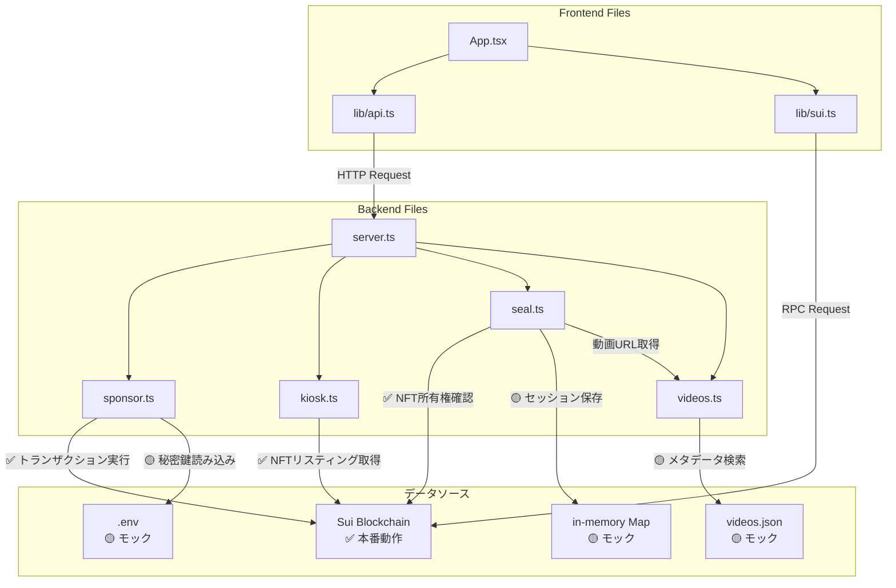

# Backend API Implementation Guide

**Issue**: #009 Backend API - KioskでSponsored Txを使った購入・Seal視聴のバックエンドAPIが動作する
**Status**: ✅ Completed
**Last Updated**: 2025-01-13

---

## 目次

1. [実装したディレクトリ構造](#1-実装したディレクトリ構造)
2. [ファイル別データソース一覧](#2-ファイル別データソース一覧)
3. [フロントエンド統合ガイド](#3-フロントエンド統合ガイド)
4. [プロダクション環境への移行手順](#4-プロダクション環境への移行手順)

---

## 1. 実装したディレクトリ構造

```
app/src/
├── App.tsx                      # メインUIコンポーネント
├── main.tsx                     # Reactエントリーポイント
│
├── assets/                      # 静的アセット
│   ├── README.md
│   └── videos.json              # 🟡 モック動画メタデータ
│
├── lib/                         # フロントエンド側ライブラリ（ブラウザ実行）
│   ├── README.md
│   ├── api.ts                   # ✅ Backend API呼び出しクライアント
│   └── sui.ts                   # ✅ Sui RPC読み取り専用クライアント
│
├── server/                      # バックエンドAPI（Node.js/Express実行）
│   ├── server.ts                # ✅ Express APIサーバー（エントリーポイント）
│   ├── sponsor.ts               # ✅ スポンサード取引実装
│   ├── kiosk.ts                 # ✅ Kiosk統合（NFTリスティング取得）
│   ├── seal.ts                  # 🟡 Seal統合（モック実装）
│   └── videos.ts                # 🟡 動画メタデータ取得（モック実装）
│
└── shared/                      # フロントエンド・バックエンド共通型定義
    └── types.ts                 # ✅ TypeScript型定義（API Request/Response等）
```

### 各ファイルの役割

#### **Frontend Files（ブラウザ実行）**

| ファイル | 役割 | 実行環境 |
|---------|------|---------|
| `App.tsx` | メインUIコンポーネント。ウォレット接続、NFT購入、動画視聴の全UI | Browser |
| `main.tsx` | Reactアプリのエントリーポイント | Browser |
| `lib/api.ts` | Backend APIへのHTTPリクエストを送信するクライアント（`/api/purchase`, `/api/watch`等） | Browser |
| `lib/sui.ts` | Sui RPCから読み取り専用データを取得（ユーザーのNFT一覧取得、NFT所有権確認） | Browser |
| `shared/types.ts` | 型定義（フロントエンド・バックエンド共通） | Browser + Node.js |

#### **Backend Files（Node.js/Express実行）**

| ファイル | 役割 | 実装状態 | データソース |
|---------|------|---------|------------|
| `server/server.ts` | Express APIサーバー。5つのエンドポイント定義（`/api/purchase`, `/api/watch`, `/api/video`, `/api/listings`, `/api/health`） | ✅ 本番動作 | 各モジュールを統合 |
| `server/sponsor.ts` | スポンサード取引。Suiトランザクションを構築・署名・実行 | ✅ 本番動作（秘密鍵管理のみモック） | Sui Blockchain |
| `server/kiosk.ts` | Kiosk統合。NFTリスティング情報を取得 | ✅ 本番動作 | Sui Blockchain |
| `server/seal.ts` | Seal統合。NFT所有権確認 + セッション管理 + 動画URL生成 | 🟡 モック（NFT所有権確認のみ本番） | Sui Blockchain（所有権確認）+ in-memory Map（セッション） |
| `server/videos.ts` | 動画メタデータ取得。BLOB IDから動画URLを取得 | 🟡 モック | `assets/videos.json`（静的ファイル） |

#### **Static Assets**

| ファイル | 役割 | 実装状態 |
|---------|------|---------|
| `assets/videos.json` | 動画メタデータ（title, description, blobId, price, URLs） | 🟡 モック（1件のみ） |

---

## 2. ファイル別データソース一覧

### 2.1 実データ取得（✅ 本番動作）

| ファイル | 関数/機能 | データソース | 取得内容 | 実装箇所 |
|---------|---------|------------|---------|---------|
| **sponsor.ts** | `sponsorPurchase()` | Sui Blockchain | トランザクション実行結果（txDigest, nftId） | L100-L143 |
| **sponsor.ts** | `buildPurchaseTransaction()` | Sui Blockchain | 共有オブジェクト対応トランザクション構築 | L48-L98 |
| **sponsor.ts** | `getSponsorBalance()` | Sui Blockchain | スポンサーアカウントのSUI残高 | L224-L228 |
| **kiosk.ts** | `getKioskListings()` | Sui Blockchain | KioskからNFTリスティング情報（price, listingId, objectId） | L25-L56 |
| **kiosk.ts** | `getListingInfo()` | Sui Blockchain | 特定のNFTリスティング情報 | L58-L64 |
| **seal.ts** | `verifyNFTOwnership()` | Sui Blockchain | NFT所有権確認 | L26-L61 |
| **seal.ts** | `createSession()` | Sui Blockchain + in-memory | セッション作成 | L63-L108 |
| **lib/sui.ts** | `getUserNFTs()` | Sui Blockchain | ユーザーが所有するNFT一覧 | L9-L27 |
| **lib/sui.ts** | `getNFT()` | Sui Blockchain | 特定のNFT情報 | L29-L48 |
| **lib/sui.ts** | `verifyOwnership()` | Sui Blockchain | NFT所有権確認（フロントエンド側） | L51-L57 |

### 2.3 データフロー図



---

## 3. フロントエンド統合ガイド

**📖 API の使い方・テスト方法の詳細**: [`app/src/server/README.md`](../../../app/src/server/README.md)
セットアップ、サーバー起動、全エンドポイント仕様、テストケース、トラブルシューティングを参照してください。

### 3.1 API エンドポイント（概要）

| エンドポイント | メソッド | 説明 |
|--------------|---------|------|
| `GET /api/health` | GET | ヘルスチェック |
| `GET /api/listings` | GET | NFT 一覧取得 |
| `POST /api/purchase` | POST | NFT 購入（スポンサード） |
| `POST /api/watch` | POST | 視聴セッション作成 |
| `GET /api/video` | GET | 動画 URL 取得 |

**基本フロー**: `listings` → `purchase` → `watch` → `video`

### 3.2 フロントエンドが参照すべきファイル

| ファイル | 用途 |
|---------|------|
| `lib/api.ts` | Backend API への HTTP リクエスト |
| `lib/sui.ts` | Sui RPC からの読み取り専用データ取得 |
| `shared/types.ts` | 型定義 |

### 3.3 環境変数の設定

#### **3.3.1 フロントエンド環境変数（app/.env）**

```bash
# Backend API URL
VITE_API_BASE_URL=http://localhost:3001/api

# Sui Network
VITE_NETWORK=devnet

# Smart Contract Package ID
VITE_PACKAGE_ID=0xc1050750c44cff13393d0f2704610ca64a24fc8d97f14e8a02b2e42b05fb22fa

# Kiosk ID（オプション、フロントエンドで直接Kioskを読む場合）
VITE_KIOSK_ID=0xb0f928168f884bba36055de85e5ef12c50a21e89ae52cfc608f54b9a39c84751
```

#### **3.3.2 バックエンド環境変数（ルート .env）**

```bash
# Network Configuration
NETWORK=devnet
RPC_URL=https://fullnode.devnet.sui.io:443

# Smart Contract IDs
PACKAGE_ID=0xc1050750c44cff13393d0f2704610ca64a24fc8d97f14e8a02b2e42b05fb22fa
KIOSK_ID=0xb0f928168f884bba36055de85e5ef12c50a21e89ae52cfc608f54b9a39c84751
TRANSFER_POLICY_ID=0x...

# 共有オブジェクトのバージョン
KIOSK_INITIAL_SHARED_VERSION=27
TRANSFER_POLICY_INITIAL_SHARED_VERSION=22

# Sponsored Transaction
SPONSOR_PRIVATE_KEY=suiprivkey1qq...  # Bech32形式

# Session Management
SEAL_SESSION_DURATION=30  # 秒単位（30=テスト用、3600=本番推奨）
SEAL_DECRYPTION_KEY=your-seal-key

# Walrus
WALRUS_API_URL=https://publisher.walrus-testnet.walrus.space
WALRUS_AGGREGATOR_URL=https://aggregator.walrus-testnet.walrus.space
```

**lib/api.tsでの使用**:
```typescript
const API_BASE_URL = import.meta.env.VITE_API_BASE_URL || 'http://localhost:3001/api';
```

**lib/sui.tsでの使用**:
```typescript
const PACKAGE_ID = import.meta.env.VITE_PACKAGE_ID || '';
```

### 3.4 型定義の活用

`shared/types.ts`をフロントエンド・バックエンド共通で使用することで、型安全性を確保する：

```typescript
// Frontend (App.tsx)
import type {
  PurchaseRequest,
  PurchaseResponse,
  WatchRequest,
  WatchResponse,
  Video,
  Session
} from './shared/types';

// ✅ TypeScriptが自動補完・型チェック
const request: PurchaseRequest = {
  nftId: "0xabc...",
  userAddress: "0x123..."
};

const response: PurchaseResponse = await purchaseNFT(request);

if (response.success) {
  console.log(response.txDigest);  // ✅ 型安全
  console.log(response.nftId);     // ✅ 型安全
}
```

---

## 4. Applendix: 将来的な修正が必要な箇所

| ファイル | 関数/機能 | 現在のデータソース | モック内容 | 改善すべき内容 | 実装箇所 |
|---------|---------|-----------------|-----------|---------------|---------|
| **sponsor.ts** | 秘密鍵管理 | `.env`ファイル（Bech32形式） | `SPONSOR_PRIVATE_KEY`（suiprivkey...）を直接読み込み | AWS KMS / Google Cloud KMS | L12, L28-L42 |
| **sponsor.ts** | **共有オブジェクト処理** | **環境変数** | **`KIOSK_INITIAL_SHARED_VERSION`, `TRANSFER_POLICY_INITIAL_SHARED_VERSION`必須** | **自動取得機能** | **L16-L17, L23-L25** |
| **sponsor.ts** | ガス量設定 | ハードコード | 固定0.5 SUI（500,000,000 MIST） | 動的ガス見積もり | L61, L76 |
| **sponsor.ts** | エラーハンドリング | try-catch + エラー分類 | `isListingMissingError()`で特定エラー検出 | 自動リトライ + Sentry連携 | L131-L143, L175-L222 |
| **sponsor.ts** | NFT ID抽出 | トランザクション結果解析 | 型安全性改善 + 複数条件チェック | より厳密な型チェック | L145-L170 |
| **seal.ts** | セッション保存 | in-memory Map | サーバー再起動で消失、分散環境非対応 | Redis / Memcached | L24 |
| **seal.ts** | **セッション再利用** | **in-memory Map** | **既存の有効セッションを再利用（パフォーマンス改善）** | **Redis対応** | **L73-L80, L150-L164** |
| **seal.ts** | 動画URL生成 | `videos.ts`から取得 | プレーンテキストURL（暗号化なし） | Seal SDK（暗号化トークン） | L86-L90 |
| **seal.ts** | 復号化キー生成 | `crypto.createHmac()` | HMAC-SHA256でNFT IDから生成 | Seal SDK（実際の暗号化/復号化） | L84, L171-L176 |
| **videos.ts** | `getVideoUrl()` | `assets/videos.json` | 静的JSON検索（1件のみ） | Database（PostgreSQL/SQLite） | L19-L22 |
| **videos.ts** | `getAllVideos()` | `assets/videos.json` | 静的JSON全体返却 | Database（ページネーション、フィルタリング対応） | L24-L30 |
| **videos.ts** | `getVideoById()` | `assets/videos.json` | 静的JSON検索 | Database | L32-L39 |
| **assets/videos.json** | 動画メタデータ | 静的ファイル | 手動編集、1件のみ | Database移行、管理画面実装 | 全体 |

---

**Last Updated**: 2025-01-13
**Author**: YuseiWhite, Claude Code
**Status**: Closed Issue #009
