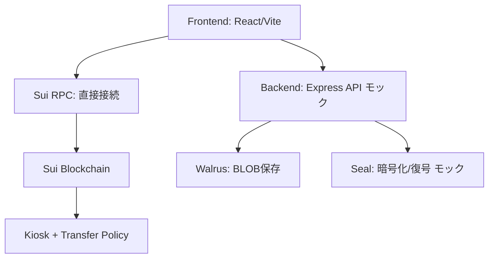

# OneTube - プロジェクト仕様書

## 1. プロジェクト概要

### 1.1 プロダクト情報
- **プロダクト名**: OneTube
- **コンセプト**: NFT保有による動画視聴権限管理のデモプラットフォーム（MVP）

### 1.2 MVP実装の特徴
- **Sui Walletによるウォレット接続**
- **Sponsored Transactionによるガス代不要の購入体験**（モック実装）
- **NFT保有による動画アクセス制御**（モック動画）
- **Kiosk標準を使ったNFT販売**
- **Transfer Policyによる収益自動分配**（70%/25%/5%）

### 1.3 将来ビジョン
- OAuth/zkLogin認証によるウォレット不要の体験
- 実Walrus/Seal統合による分散型動画配信
- 複数NFT種類対応（チケットNFT、選手NFT等）
- 詳細は `docs/future-features.md` を参照

---

## 2. ビジネス要件

### 2.1 目的
- One championshipのあらゆるコアファンが非言語で試合と選手の動画を視聴・交流すること
- 選手は応援されることで試合に出たり収入源を得たりできること

### 2.2 ターゲットユーザー
- One championshipのチケットを購入して試合を見る人の中で過去試合を見たい人

以下は余裕があったら満たすことができる実装に入りたい
- One championshipで好きな選手と交流したい人
- One championshipの選手の中でクリエイターエコノミーを作りたい人（自身のコアファン向けコンテンツ作成と共有）

### 2.3 ビジネス目標
- テストネットで2.1を達成できることを技術的・ユーザ体験として理解すること

### 2.4 MVP目標（本プロジェクトの実装範囲）

#### 開発者向け目標
- **Suiエコシステム（Kiosk/Walrus/Seal/Sponsored Transaction）の統合を実証**
  - スマートコントラクト: Kiosk + Transfer Policy統合
  - バックエンド: モックAPI（Sponsored Tx, Seal復号キーは.env管理）
  - 統合テスト: deploy → seed → purchase → watch の一連フロー
- **各コンポーネントの統合テストを完成させる**
- **3日間で動作するデモを完成**

#### 消費者向け目標（フロントエンド）
- **NFT保有による動画視聴のUXをデモ**
  - Walrusサイトにデプロイ済みのモック動画を表示
  - 価格表示（物理チケット + プレミアムチケット差額）
  - セッション期限切れ体験（10秒）
- **Web2的なシームレスな購入体験を実現**
  - Sponsored Transactionによるガス代不要（モック）
  - Sui Walletによるシンプルな認証

#### MVP対象外（将来機能）
- 本番セキュリティ対策（APIレート制限、セキュリティ監査）
- パフォーマンス最適化（スケーラビリティ・負荷対策）
- 拡張性設計（複雑なコンポーネント分割）
- OAuth/zkLogin統合（Phase 2で実装）
- 実ストリーミング配信（HLS/DASH）

---

## 3. 機能要件概要

### 3.1 ファン視点の基本フロー

あらかじめ試合のチケット+プレミアムを購入する

**購入フロー:**
- Sponsored Transactionでガス代不要（モック）
- Kiosk購入完了
  - Kioskで購入処理実行
  - NFTがユーザーウォレットに転送

**視聴フロー:**

1. **Webアプリにアクセス**
   - Sui Walletでウォレット接続
   - **MVP**: ウォレット接続のみ（OAuth/zkLoginは将来機能）

2. **試合一覧の表示**
   - 最近の試合一覧を表示
   - サムネイル、タイトル、プレミアムチケットで見れるアイコン（持ってないものは白黒で表示）を表示

3. **コンテンツ選択**
   - 例: 「Superbon vs Masaaki Noiri KOシーン NFT」を選択
   - 10秒プレビュー映像を視聴（認証不要、誰でも可）

4. **完全版コンテンツのアンロック**
   - 「完全版を見る」がアンロック
   - NFT所有権に基づくアクセス制御

5. **動画視聴**
   - Sealが復号キーを発行（セッションキー、有効期限は環境変数で設定）
   - Walrusから4K・マルチアングル映像をストリーミング再生
   - 1秒単位のシークバーで再生位置調整可能

**プレミアムチケットを持ってないコンテンツを選択した場合:**
- 「完全版を見る」ボタン表示 → プレミアムチケットNFT購入が必要

### 3.2 NFTの種類（MVP）

#### プレミアムチケットNFT（MVPで実装）

**概要:**
- 動画コンテンツへのアクセス権を提供するNFT
- Kiosk経由で購入可能

**MVP価格:**
- 0.5 SUI（テスト用）

**特典:**
- 全試合動画視聴可能
- プレミアムコンテンツのアンロック

**備考:**
- 将来的には、チケットNFT（物理観戦チケット）や選手NFTも追加予定
- 詳細は `docs/future-features.md` を参照

---

## 4. システムフロー

### 4.1 全体フロー（3フェーズ）

#### Phase 1: 事前準備フェーズ（運営側）

運営（ONE Championship）が行う準備プロセス：

1. **Walrus: 動画アップロード**
   - プレビュー版（10秒）のアップロード
   - 完全版（4K・マルチアングル）のアップロード
   - BLOB ID取得

2. **Seal: 完全版動画の暗号化**
   - 完全版動画をAES-256で暗号化
   - アクセスポリシー（SealPolicy）設定
   - アクセス条件: プレミアムチケットNFT所有

3. **Sui Smart Contract: mint_batchで在庫作成**
   - NFTをバッチで一括発行
   - メタデータ設定（タイトル、BLOB ID、価格等）
     - 最小限
     - 今回必要なもののみ

4. **Kiosk: 在庫をデポジット & 価格設定**
   - 発行したNFTをKioskにデポジット
   - 販売価格を設定
   - Transfer Policy設定（ロイヤリティ、収益分配ルール）
     - ハードコード

#### Phase 2: ユーザー購入フェーズ（ファン）

5. **Sponsored Transaction: ガス代なし購入**（モック実装）
   - バックエンドのガス代負担設定（.envから秘密鍵読み込み）
   - トランザクション署名サービス準備

6. **NFT購入処理実行**
   - Kioskでの購入処理（在庫引当/引き出し + 代金受領）

7. **収益自動分配**
   - Sui Smart Contractによるフック/コールバック
   - アスリート70% / ONE 25% / Platform 5%に自動分配

#### Phase 3: 視聴フェーズ（ファン）

8. **NFT所有権確認**
   - Sui on-chainでNFT保有チェック

9. **Seal: 復号キー発行**（モック実装）
   - セッションキー生成（.envから復号キー読み込み）
   - 有効期限: 環境変数（SEAL_SESSION_DURATION）で設定可能
     - 本番環境: 1時間（3600秒）
     - MVP環境: 10秒（期限切れテストのため）

10. **Walrus: コンテンツ配信**
    - 暗号化BLOBを復号
    - ストリーミング配信開始

### 4.2 テックスタック別フロー

**事前準備:**
- Walrus → 動画保存
- Seal → 暗号化
- Sui Contract → mint_batch, 在庫作成
- Kiosk → 在庫デポジット & 価格設定

**購入:**
- Sponsored Tx（モック） → ガス代負担
- Kiosk → 購入実行（在庫引当/引き出し）
- Sui Contract → 収益分配（フック/コールバック）

**視聴:**
- Sui → 所有確認
- Seal（モック） → 復号キー発行
- Walrus → コンテンツ配信

### 4.3 購入フローシーケンス（詳細）

1. **User → Frontend**: Wallet接続
2. **Frontend → Sui RPC**: NFTリスト取得
3. **Sui RPC → Frontend**: 販売中NFT一覧返却
4. **User → Frontend**: 購入ボタンクリック
5. **Frontend → Backend**: 購入リクエスト
6. **Backend**: ガス代を負担（Sponsored Transaction - モック）
   - .envからSPONSOR_PRIVATE_KEY読み込み
   - モックトランザクション構築
7. **Backend → Kiosk**: Purchase実行
8. **Sui → Sui**: 収益分配実行
9. **Sui → User**: NFT転送完了

### 4.4 視聴フローシーケンス（詳細）

1. **User → Frontend**: 視聴リクエスト
2. **Frontend → Sui**: NFT所有確認
3. **Sui → Frontend**: 所有確認OK
4. **Frontend → Backend**: アクセス要求
5. **Backend → Seal**: 復号キー要求（モック）
   - .envからSEAL_DECRYPTION_KEY読み込み
6. **Seal → Sui**: NFT再確認
7. **Sui → Seal**: 確認OK
8. **Seal → Backend**: 復号キー発行（セッションキー、有効期限は環境変数で設定）
9. **Backend → Walrus**: コンテンツ取得
10. **Walrus → Backend**: 暗号化BLOB返却
11. **Backend**: Sealで復号（モック）
12. **Backend → User**: ストリーミング配信
13. **User**: 視聴開始

---

## 5. テックスタック

### 5.0 テックスタック一覧

| カテゴリ | 技術 | 役割 | MVP実装 |
|---------|------|------|---------|
| **Blockchain** | Sui | スマートコントラクト実行、NFT管理 | ✅ devnet |
| **Smart Contract** | Move | mint_batch、Transfer Policy、収益分配 | ✅ 実装 |
| **NFT販売** | Kiosk | 標準化されたNFT販売プラットフォーム | ✅ 実装 |
| **ガス代負担** | Sponsored Transaction | ユーザのガス代をプラットフォームが負担 | ✅ 実装 |
| **ストレージ** | Walrus | 分散型動画ファイル保存 | ✅ 実統合 |
| **アクセス制御** | Seal | コンテンツ暗号化/復号、セッションキー管理 | ✅ 実統合 |
| **Frontend** | React + Vite | ユーザーUI（一覧→購入→視聴） | ✅ モックUI |
| **Backend** | Express | API（purchase/watch）、Seal統合 | ✅ 実装 |
| **Package Manager** | pnpm | 依存関係管理 | ✅ 10.x |
| **Linter/Formatter** | Biome | コード品質管理 | ✅ 2.x |
| **Container** | Docker Compose | 開発環境 | ⚠️ オプション |

### 5.1 Sui エコシステム

#### 5.1.1 Kiosk（NFT販売）

**役割**: NFTの標準化された販売プラットフォーム

**機能:**
- 標準化された出品/購入プリミティブ
  - 価格設定
  - 在庫管理
  - 取消し機能
  - 安全ガード機能
- ロイヤリティ/Transfer Policyとの統合
  - 二次流通の自然な拡張
- 既存のSuiウォレット/マーケットとの相互運用
  - 将来の露出・流動性確保
- 標準UI/ライブラリの活用
  - 実装コスト圧縮

#### 5.1.2 Sponsored Transaction（ガス代負担）

**役割**: ユーザーのガス代をプラットフォームが負担

**仕組み（MVP: モック実装）:**
- バックエンドサーバーがガス代を負担
- .envからSPONSOR_PRIVATE_KEY読み込み
- ユーザーのトランザクションに署名を追加（モック処理）
- ユーザーは購入代金のみを支払う

**ユーザー体験:**
- ガス代の概念を意識不要
- Web2的なシームレスな購入体験

#### 5.1.3 Sui Smart Contract（NFT発行・収益分配）

**役割**: NFTのライフサイクル管理と収益分配

**機能:**
- **NFT発行:**
  - `mint_batch`関数による一括発行
  - メタデータ管理（タイトル、BLOB ID、価格等）
- **収益分配:**
  - Transfer Policyのフック/コールバック機能
  - 購入時の自動分配処理
  - 分配比率: アスリート 70% / ONE 25% / Platform 5%

#### 5.1.4 Walrus（コンテンツ保存）

**役割**: 分散型ストレージによる動画ファイル保存

**主な機能:**
- BLOB保存（プレビュー版 + 完全版）
- 高可用性（Erasure Coding: 100ノード構成、66ノード障害耐性）
- BLOB ID管理

#### 5.1.5 Seal（アクセス制御）

**役割**: コンテンツの暗号化とアクセス制御

**主な機能（MVP: モック実装）:**
- 暗号化（AES-256）
- on-chain SealPolicy（アクセス条件: NFT所有）
- セッションキー発行（有効期限: 10秒、.envから復号キー読み込み）

### 5.2 フロントエンド・バックエンド

#### 5.2.1 React + Vite（フロントエンド）

**役割**: ユーザーインターフェース

**主な機能:**
- 試合一覧表示
- NFT購入UI
- 動画プレーヤー（Walrusサイトから読み込み）
- ウォレット接続（Sui Wallet）

**技術:**
- React
- Vite（ビルドツール）
- Sui Wallet Adapter

#### 5.2.2 Express（モックAPI）

**役割**: バックエンドAPI（モック実装）

**主な機能:**
- POST /api/purchase（モック: ダミー成功レスポンス）
- POST /api/watch（モック: ダミーセッションキー返却）
- GET /api/health（ヘルスチェック）

**技術:**
- Express 4.x
- TypeScript

### 5.3 開発ツール

| ツール | 役割 | バージョン |
|-------|------|----------|
| pnpm | パッケージマネージャー | 10.x |
| Biome | Linter/Formatter | 2.x |
| Docker Compose | ローカル開発環境 | 3.x |
| Sui CLI | Moveコントラクトデプロイ | - |

---

## 6. システムアーキテクチャ

### 6.1 全体構成



### 6.2 設計方針（MVP）

#### 優先順位
1. **動作する** → テストが通る
2. **わかりやすい** → コードが読みやすい
3. **速く書ける** → ボイラープレート最小
4. 拡張性は無視（MVPのゴール達成を最優先）

---

## 7. プロジェクト構成

### 7.1 ディレクトリ構造（イメージ）

```
one-tube/
├─ contracts/                         # Move（Kiosk前提）
│  ├─ Move.toml                       # [package] name = "one_tube"
│  ├─ sources/
│  │  └─ one_tube.move               # mint_batch, 分配フック
│  └─ tests/
│     └─ one_tube_tests.move         # ユニットテスト + Walrus/Seal統合テスト
│
├─ app/                               # Vite(React) + Express(API) 同居
│  ├─ index.html
│  ├─ src/
│  │  ├─ main.tsx                     # FEエントリ
│  │  ├─ App.tsx                      # 全UI
│  │  ├─ lib/                         # FE（ブラウザ）側
│  │  │  ├─ sui.ts                    # RPC読み取り
│  │  │  └─ api.ts                    # /api呼び出し
│  │  ├─ server/                      # API（Node/Express）側
│  │  │  ├─ server.ts                 # Express API定義
│  │  │  ├─ sponsor.ts                # Sponsored Tx署名（モック）
│  │  │  ├─ kiosk.ts                  # Kiosk操作
│  │  │  └─ seal.ts                   # Seal統合（モック）
│  │  ├─ assets/                      # Walrusサイトへのリンク管理
│  │  │  └─ videos.json               # モック動画メタデータ
│  │  └─ styles.css
│  ├─ vite.config.ts
│  ├─ tsconfig.json                   # FE向け
│  ├─ tsconfig.node.json              # server用
│  ├─ package.json
│  └─ Dockerfile
│
├─ scripts/
│  ├─ tool.ts                         # CLI (deploy/seed/demo)
│  └─ update-package-id.ts            # deploy後に.env更新
│
├─ tests/
│  └─ e2e.spec.ts                     # devnet E2E
│
├─ docs/
│  ├─ project-spec.md                 # プロジェクト仕様書（本ファイル）
│  ├─ development-workflow.md         # Issue駆動開発ガイド
│  ├─ future-features.md              # 将来機能
│  └─ issues/                         # Issue管理
│     └─ 001-smart-contract/
│        ├─ spec.md
│        ├─ plan.md
│        └─ tasks.md
│
├─ .env.example                       # 環境変数テンプレート
├─ compose.yml                        # Docker Compose
├─ Makefile                           # タスクランナー
├─ package.json                       # ルート
└─ README.md
```

### 7.2 ファイル数の目安

- **コア実装**: 約8-10ファイル
- **合計**: 約20ファイル

詳細なファイル配置は各Issue（plan.md）で決定

---

## 8. API要件（モック実装）

### 8.1 モックAPI方針

**MVP実装方針**:
- Backend APIのエンドポイントは作成するが、実際の処理はモック
- テスト用のダミーレスポンスを返す
- Sponsored TransactionとSeal復号キーは環境変数（.env）で管理

**環境変数設定**:
```bash
# Sponsored Transaction用
SPONSOR_PRIVATE_KEY=suiprivkey...   # サーバ用秘密鍵（モック）

# Seal復号用
SEAL_DECRYPTION_KEY=your-seal-key   # Seal復号キー（モック）
SEAL_SESSION_DURATION=10            # セッション有効期限（秒、MVP: 10秒）
```

### 8.2 エンドポイント一覧

| メソッド | パス | 説明 | モック動作 |
|---------|------|------|-----------|
| POST | `/api/purchase` | NFT購入 | ダミー成功レスポンス（モック）|
| POST | `/api/watch` | 動画視聴権限確認 | ダミーセッションキー返却（モック） |
| GET | `/api/health` | ヘルスチェック | { status: "ok" } |

### 8.3 データフロー概要

#### 購入フロー（モック）
```
Frontend (App.tsx)
  ↓ handlePurchase()
  ↓ lib/api.ts: POST /api/purchase
  ↓
Backend (server.ts) - モック実装
  ↓ sponsor.ts: モック署名処理（.envから秘密鍵読み込み）
  ↓ kiosk.ts: ダミーKiosk購入TX
  ↓ モックレスポンス: { success: true, txDigest: "0x...", nftId: "0x..." }
  ↓
Frontend
  ↓ 購入完了表示（モック）
```

#### 視聴フロー（モック）
```
Frontend (App.tsx)
  ↓ handleWatch()
  ↓ lib/api.ts: POST /api/watch
  ↓
Backend (server.ts) - モック実装
  ↓ seal.ts: モック復号キー発行（.envから復号キー読み込み）
  ↓ モックレスポンス: { success: true, sessionToken: "mock-token", videoUrl: "https://walrus.site/..." }
  ↓
Frontend
  ↓ <video src={videoUrl} /> で再生（モック動画）
```

**注意**: 実際のSponsored TransactionやSeal統合は将来実装（MVP対象外）

---

## 9. 収益分配モデル

### 9.1 分配比率
- **アスリート**: 70%
- **ONE Championship**: 25%
- **Platform**: 5%

### 9.2 分配タイミング
- NFT購入時に自動実行
- Sui Smart ContractのTransfer Policyフック/コールバックで処理

### 9.3 分配方式
- on-chain自動実行
- 手動処理不要
- リアルタイム分配

---

## 10. アクセス制御仕様

### 10.1 NFT保有による視聴権限

**アクセス条件:**
- プレミアムチケットNFT所有者のみが完全版動画を視聴可能
- プレビュー版（10秒）は認証不要で誰でも視聴可能

**所有権確認:**
- Sui on-chainでリアルタイム確認
- NFTの所有者アドレスとリクエスト元ウォレットアドレスを照合

### 10.2 セッションキー管理（モック実装）

**発行条件:**
- NFT所有権確認後
- SealPolicyの条件を満たす場合（モック）

**キー仕様:**
- 形式: セッションキー（JWT等、モック）
- 有効期限: 環境変数（SEAL_SESSION_DURATION）で設定可能
  - 本番環境: 1時間（3600秒）
  - MVP環境: 10秒（検証用）
- スコープ: 特定のBLOB IDへのアクセス権限

**セキュリティ:**
- 1回の認証で設定された時間の視聴が可能
- 期限切れ後は再認証が必要
- NFTを手放した場合、新規セッションキーは発行不可

### 10.3 Seal暗号化/復号（モック実装）

**暗号化:**
- アルゴリズム: AES-256
- 暗号化対象: 完全版動画BLOB
- 鍵管理: .envからSEAL_DECRYPTION_KEY読み込み（モック）

**復号:**
- NFT所有確認後に復号キー発行（モック）
- セッションベースの一時的なアクセス権限
- 暗号化されたBLOBをリアルタイムで復号しながらストリーミング配信（モック）

---

## 11. MVP実装範囲

### 11.1 実装する機能

- ✅ **Kiosk標準APIを使用したNFT販売**
  - 事前mint（`mint_batch`）→ Kioskへのデポジット
  - 価格設定（0.5 SUI固定）
  - 購入処理（在庫引当/引き出し）

- ✅ **Sponsored Transaction（モック実装）**
  - サーバ側で署名・ガス代負担（モック）
  - .envからSPONSOR_PRIVATE_KEY読み込み
  - ユーザは購入代金のみ支払い

- ✅ **Transfer Policy 収益分配**
  - 70%/25%/5%の自動分配
  - on-chain実行

- ✅ **Walrus BLOB保存（モック）**
  - Walrusサイトにデプロイ済みのモック動画を表示
  - BLOB ID管理

- ✅ **Seal統合（モック実装）**
  - on-chain SealPolicy設定（モック）
  - NFT所有確認に基づく復号キー発行（モック）
  - セッションキー管理（有効期限: 10秒、.envから復号キー読み込み）

- ✅ **シンプルなUI（App.tsx単一コンポーネント）**
  - 試合一覧表示
  - 購入ボタン
  - 動画プレーヤー

### 11.2 実装しない機能（将来機能）

**認証・ウォレット:**
- ❌ OAuth/zkLogin認証（Sui Walletのみで実装）

**フロントエンド:**
- ❌ 実際のストリーミング配信（HLS/DASH）
- ❌ 複雑なコンポーネント分割
- ❌ 状態管理ライブラリ（Redux等）

**パフォーマンス**

**セキュリティ**

**NFT種類:**
- ❌ 複数NFT種類の同時サポート
- ❌ 選手NFT

### 11.3 技術的な実装方針

- **MVP優先**: 動作する → わかりやすい → 速く書ける
- **拡張性は無視**
- **テスト重視**: Contract Test → Integration Test → E2E Test
- **モック活用**: Sponsored TransactionとSeal復号は.env管理

詳細な実装方法は各Issue（spec.md → plan.md）で決定

---

## 12. 制約条件

### 12.1 ガス代負担
- プラットフォームがSponsored Transactionで全額負担（モック実装）
- ユーザーはガス代を意識不要
- 購入代金のみをユーザーが支払う

### 12.2 価格設定（MVP）

**実際の購入価格:**
- MVP価格: 0.5 SUI（固定）

**フロントエンド表示価格（ユーザー体験用）:**
- 通常チケット価格: ¥20,000 〜 ¥558,000
  - 例:
    - VVIP Top: JPY 558,000
    - VVIP Row 2 onwards: JPY 358,000
    - ＶＩＰ：JPY 168,000
    - ＣＡＴ１：JPY 60,000
    - ＣＡＴ２：JPY 50,000
    - ＣＡＴ３：JPY 28,000
    - CAT3 Nogi Cheering Seats: JPY 32,000
    - ＣＡＴ４：JPY 25,000
    - ＣＡＴ５：JPY 20,000
- プレミアムチケットNFT: +¥5,000
  - 1ヶ月間過去試合見放題 + 選手は個人レベルでクリエイターエコノミーをカスタマイズするために利用できる（柔軟性）

### 12.3 インフラ（MVP）

**スマートコントラクト/バックエンド:**
- Blockchain: Sui (devnet)
- Storage: Walrus（モック: Walrusサイトにデプロイ済みのモック動画）
- Access Control: Seal（モック実装）

**フロントエンド:**
- 動画配信: Walrusサイトにデプロイ済みのモック動画
- ユーザー体験: モックUI（価格表示、セッション管理等）

### 12.4 環境変数

```bash
# ネットワーク
NETWORK=devnet
RPC_URL=https://fullnode.devnet.sui.io:443

# コントラクト
PACKAGE_ID=0x...                    # deploy後に自動更新
KIOSK_ID=0x...                      # deploy後に自動更新
KIOSK_CAP_ID=0x...                  # deploy後に自動更新
TRANSFER_POLICY_ID=0x...            # deploy後に自動更新
KIOSK_PACKAGE_ID=0x...              # 公式Kiosk

# Sponsored Transaction（モック）
SPONSOR_PRIVATE_KEY=suiprivkey...   # サーバ用秘密鍵（モック）

# セッション管理（モック）
SEAL_SESSION_DURATION=10            # 秒単位（MVP: 10秒、本番: 3600秒）
SEAL_DECRYPTION_KEY=your-seal-key   # Seal復号キー（モック）

# Walrus（モック）
WALRUS_API_URL=https://publisher.walrus-testnet.walrus.space
WALRUS_AGGREGATOR_URL=https://aggregator.walrus-testnet.walrus.space

# Seal（モック）
SEAL_POLICY_ID=0x...                # deploy後に自動更新（モック）
```

### 12.5 収益分配
- 分配比率は固定: アスリート 70% / ONE 25% / Platform 5%
- on-chain自動実行（Transfer Policy）

### 12.6 動画仕様（MVP）

**スマートコントラクト/バックエンド:**
- Walrus BLOB保存（モック）
- Seal暗号化/復号（モック）
- BLOB ID管理

**フロントエンド:**
- Walrusサイトにデプロイ済みのモック動画
- 形式: .mp4ファイル
- プレビュー: 10秒程度
- 完全版: 30秒-1分程度
- 4K・マルチアングルは将来機能

---

## 将来機能について

将来的な拡張機能については、`docs/future-features.md` を参照してください。
